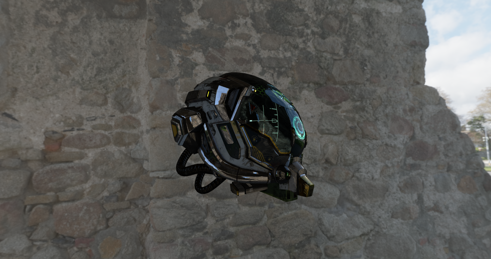

# Vulkan Renderer / Engine

A small real-time rendering engine written in **C++ using Vulkan**.  
The project implements a **forward rendering pipeline with physically based rendering (PBR)** and **image-based lighting (IBL)**, along with a basic engine architecture including a scene graph, asset loading, and resource management.

<p align="center">
  
</p>

*(Example render produced by the engine)*

---

## Features

- Vulkan-based renderer
- Forward PBR shading
- Image-based lighting
- glTF 2.0 asset loading
- Scene graph system
- GPU resource manager
- Dear ImGui debug UI
- Environment map precomputation
- RAII Vulkan object wrappers

---

## Requirements

Before building the project, make sure you have installed:

- **Visual Studio 17 2022** (Open Folder support required)  
- **Vulkan SDK**  
- **CMake (≥ 3.21)**  
- **vcpkg**

Ensure that `VCPKG_ROOT` is set as an environment variable pointing to your vcpkg installation.

---

## Installing Dependencies

The project uses **vcpkg** to manage third-party libraries.  
Run the following command to install dependencies:

```bash
vcpkg install glm glfw3 tinyobjloader vulkan-memory-allocator fastgltf mikktspace imgui[vulkan-binding,glfw-binding]:x64-windows stb

```

This installs:

glm

glfw

tinyobjloader

Vulkan Memory Allocator

fastgltf

mikktspace

Dear ImGui (Vulkan + GLFW bindings)

stb

## Building the Project

The project uses CMake presets for configuration.

Debug Build
```bash
cmake --preset x64-debug
cmake --build --preset build-debug
```
Output directory:
```bash
build/debug
```
Release Build
```bash
cmake --preset x64-release
cmake --build --preset build-release
```
Output directory:
```bash
build/release
```

## Opening in Visual Studio


To open the project in Visual Studio 2022:

1. Open Visual Studio 2022

1. Click File → Open → Folder

1. Select the root directory of this repository

1. Visual Studio will detect the CMake presets automatically

This allows you to make changes, build, configure, and run the project directly from the IDE.

## Project Structure

```bash
Engine/
Renderer/
Shaders/
```

* Engine – scene graph, asset loading, resource management, UI

* Renderer – Vulkan rendering pipeline and GPU abstractions

* Shaders – GLSL shader sources and compiled SPIR-V binaries